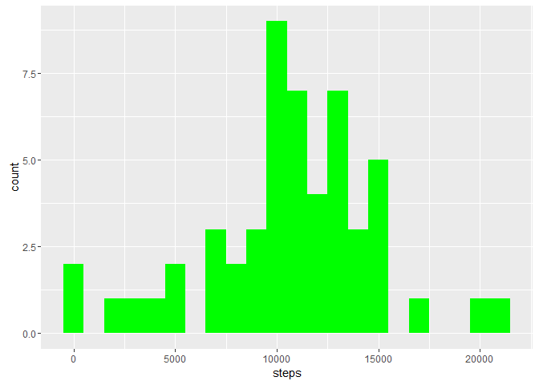
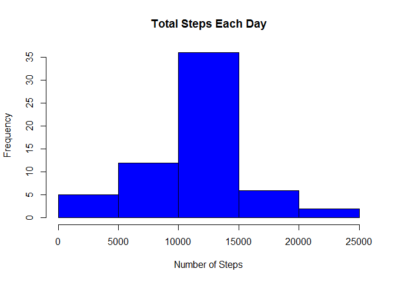

# Reproducible Research: Peer Assessment 1
Chris Aoyama  


##Loading and preprocessing the data
### Install and open packages

```r
library(ggplot2)
```

```
## Warning: package 'ggplot2' was built under R version 3.1.3
```

```r
library(knitr)
```

```
## Warning: package 'knitr' was built under R version 3.1.3
```

```r
library(lubridate)
```

```
## Warning: package 'lubridate' was built under R version 3.1.3
```

```r
library(dplyr)
```

```
## Warning: package 'dplyr' was built under R version 3.1.3
```

```
## 
## Attaching package: 'dplyr'
```

```
## The following objects are masked from 'package:lubridate':
## 
##     intersect, setdiff, union
```

```
## The following objects are masked from 'package:stats':
## 
##     filter, lag
```

```
## The following objects are masked from 'package:base':
## 
##     intersect, setdiff, setequal, union
```
### Loading data

```r
data <- read.csv("activity.csv", header = TRUE,
sep = ",", colClasses = c("numeric", "character", "integer"))
```
### Tidy data

```r
data$date <- ymd(data$date)
```
##What is mean total number of steps taken per day?

```r
steps <- data %>%
  filter(!is.na(steps)) %>%
  group_by(date) %>%
  summarize(steps = sum(steps)) %>%
  print
```

```
## Source: local data frame [53 x 2]
## 
##          date steps
##        (time) (dbl)
## 1  2012-10-02   126
## 2  2012-10-03 11352
## 3  2012-10-04 12116
## 4  2012-10-05 13294
## 5  2012-10-06 15420
## 6  2012-10-07 11015
## 7  2012-10-09 12811
## 8  2012-10-10  9900
## 9  2012-10-11 10304
## 10 2012-10-12 17382
## ..        ...   ...
```
### Print histogram

```r
ggplot(steps, aes(x = steps)) + 
  geom_histogram(fill = "green", binwidth = 1000) 
```



```r
  labs(title = "Histogram of Steps per day", 
  x = "Steps per day", y = "Frequency")
```

```
## $title
## [1] "Histogram of Steps per day"
## 
## $x
## [1] "Steps per day"
## 
## $y
## [1] "Frequency"
## 
## attr(,"class")
## [1] "labels"
```
### Find mean of steps

```r
step_mean <- mean(steps$steps, na.rm = TRUE)
step_mean
```

```
## [1] 10766.19
```
### Find median of steps

```r
step_median <- median(steps$steps, na.rm = TRUE)
step_median
```

```
## [1] 10765
```
## What is the average daily activity pattern?

### Find interval

```r
steps_by_interval <- aggregate(steps ~ interval, data, mean)

plot(steps_by_interval$interval,steps_by_interval$steps, type="l", xlab="Interval", ylab="Number of Steps",main="Average Number of Steps per Day by Interval")
```


```r
max_interval <- steps_by_interval[which.max(steps_by_interval$steps),1]
max_interval
```

```
## [1] 835
```

## Imputing missing values
### Total NA's

```r
sum(is.na(data$steps))
```

```
## [1] 2304
```
### Fill in data

```r
data_fill <- transform(data, steps = ifelse(is.na(data$steps), 
steps_by_interval$steps[match(data$interval, steps_by_interval$interval)], data$steps))
```

### New dataset using data_fill

```r
  steps_fill <- data_fill %>%
  filter(!is.na(steps)) %>%
  group_by(date) %>%
  summarize(steps = sum(steps)) %>%
  print
```

```
## Source: local data frame [61 x 2]
## 
##          date    steps
##        (time)    (dbl)
## 1  2012-10-01 10766.19
## 2  2012-10-02   126.00
## 3  2012-10-03 11352.00
## 4  2012-10-04 12116.00
## 5  2012-10-05 13294.00
## 6  2012-10-06 15420.00
## 7  2012-10-07 11015.00
## 8  2012-10-08 10766.19
## 9  2012-10-09 12811.00
## 10 2012-10-10  9900.00
## ..        ...      ...
```
### Plot histogram of the total number of steps taken

```r
hist(steps_fill$steps, main = paste("Total Steps Each Day"), col="blue", xlab="Number of Steps")
```


### Find mean

```r
mean_steps_fill <- mean(steps_fill$steps, na.rm = TRUE)
mean_steps_fill
```

```
## [1] 10766.19
```
### Find median

```r
median_steps_fill <- median(steps_fill$steps, na.rm = TRUE)
median_steps_fill
```

```
## [1] 10766.19
```
### Do these values differ from the estimates from the first part of the assignment?

```r
mean_diff <- mean_steps_fill - step_mean
mean_diff
```

```
## [1] 0
```

```r
median_diff <- median_steps_fill - step_median
median_diff
```

```
## [1] 1.188679
```
## Are there differences in activity patterns between weekdays and weekends?

### Create new factors

```r
weekdays <- c("Monday", "Tuesday", "Wednesday", "Thursday","Friday")
data_fill$dow = as.factor(ifelse(is.element(weekdays(as.Date(data_fill$date)),weekdays), "Weekday", "Weekend"))

steps_interval <- aggregate(steps ~ interval + dow, data_fill, mean)
```
###Plot weekday vs. weekend

```r
library(lattice)

xyplot(steps_interval$steps ~ steps_interval$interval|steps_interval$dow, main="Average Steps per Day by Interval",xlab="Interval", ylab="Steps",layout=c(1,2), type="l")
```


